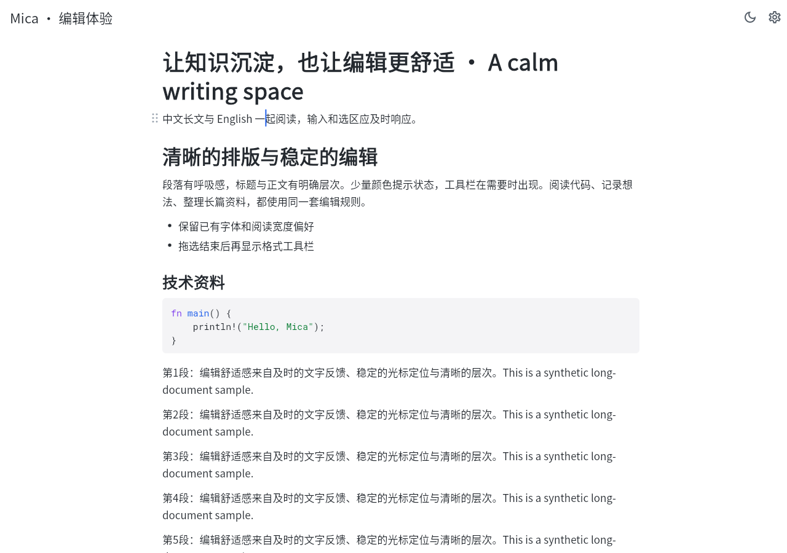
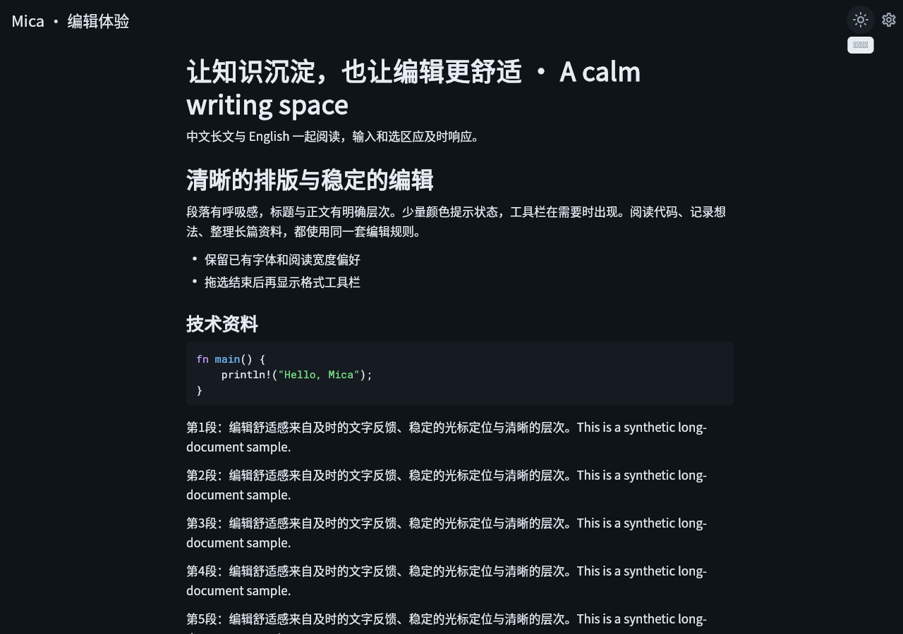
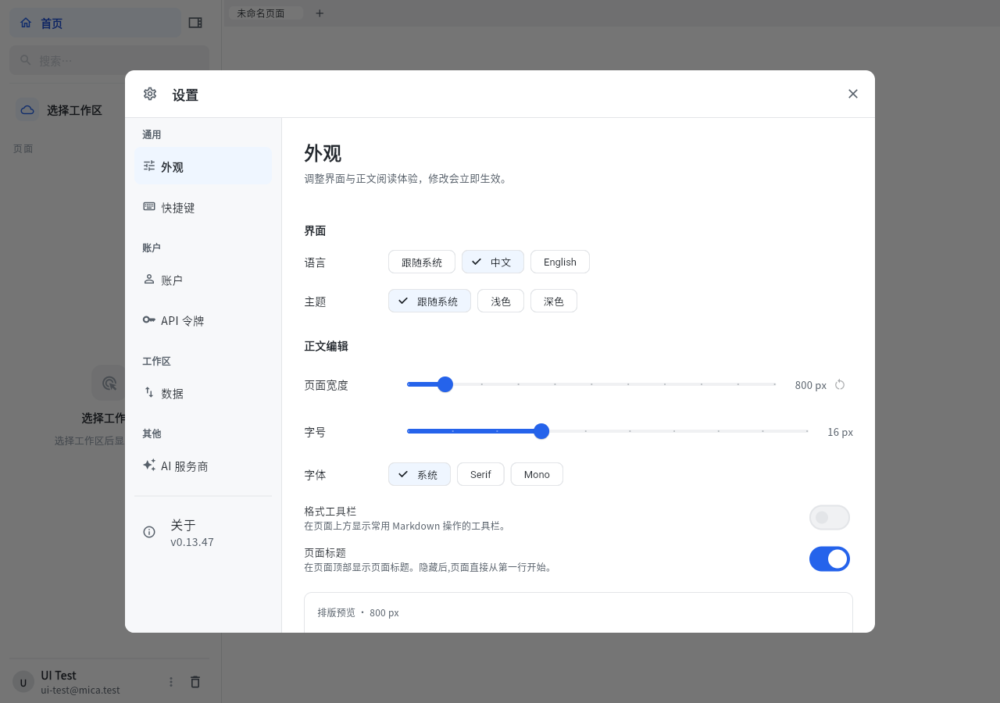
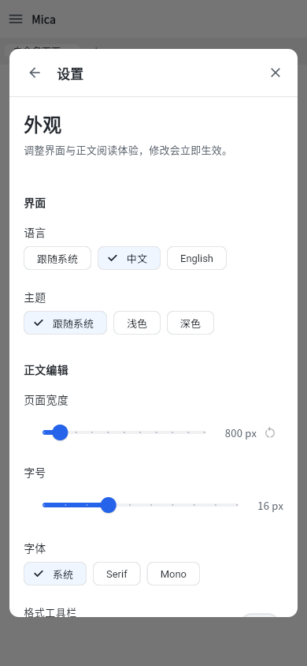

# UI 与编辑舒适感：实施与验证

日期：2026-10-07。对应 [实施方案](UI_EDITING_EXPERIENCE_PLAN.md)，基线 `0aa1266`。

## 本轮结果

| 范围 | 最终行为 | 主要证据 |
| --- | --- | --- |
| 长文光标与选区 | 内容修订号与选区通知分离；普通段落选区只重绘，内容/字号/宽度/颜色更新仍失效布局 | 207 块真实浏览器文档连续 12 次 Right，布局次数 **2 → 2**；200 段 widget 回归；代码水平定位、details 源码与折叠、图片/预览缓存独立测试 |
| 拖选和滚动 | 拖选时隐藏格式栏，松开后显示；原始 pointer cancel 清理状态且不提交块移动/缩放；边缘滚动按调度帧与实际时间推进 | 浏览器真实鼠标按下/移动/释放；widget 取消、边缘滚动、390×260 触摸滑动测试 |
| 输入法 | 新布局完成后报告光标和 composing 锚点；相同文本的选择变化不重复写内容 | 浏览器 CDP 预编辑与原生输入提交，各只出现一次；widget 检查 OS 通道坐标。**微软拼音系统候选窗未人工确认** |
| 排版与主题 | 页面标题独立层级并自然换行；正文标题 600 字重，调整章节/列表间距；公式不重复字号缩放；调色板参与缓存判定 | 长标题/Enter/ArrowDown/软件键盘 next/IME/read-only 回归；公式缩放比、主题缓存、命中与几何测试；浅深色截图 |
| 正文外壳 | 窄屏正文边距 12px，宽屏 28px；窄屏格式栏单独横向滚动；保留标题保存与正文焦点回调 | 生产 Windows release 构建；页面标题组件与真实编辑器浏览器夹具。夹具不代替生产外壳全部操作验收 |
| 设置 | 桌面分类侧栏，窄屏分类→详情；返回/关闭固定，内容单独滚动；外观即时预览；AI 局部加载/错误重试；账号成功与错误分开反馈 | 320/390/768/1440px、280px 短屏、1.8 倍文字、350px 键盘、路由中的主题更新回归；完整生产设置入口的浏览器冒烟 |
| 系统控件 | Material 控件使用现有语义色、中文 fallback、统一按钮/菜单/表单形状 | 既有主题测试；浅深色真实画布与生产设置截图 |

内容通知的迁移同时检查了所有结构编辑：插入/删除/合并/拆分/粘贴等操作结束时使用 `_collapseAfterEdit`。不能把它们也当成普通选区更新，否则会留下旧布局。未提供 `contentRevision` 的其它 surface 调用者保留原有失效行为。

## 自动化结果

- 新增 39 个针对性 Flutter 回归用例，覆盖交互、选择布局、排版、标题、设置。
- `dart analyze`：0 error / 0 warning，136 个既有风格类 info。
- `flutter build windows --release`：通过，259.1s。产物 `clients/mica_flutter/build/windows/x64/runner/Release/mica_flutter.exe`。
- 浏览器 release bundle：构建通过。Playwright 的输入、撤销、中文预编辑/提交、拖选格式栏时机、浅深色、390px 设置导航、生产设置 AI 挂起/503/重试全部通过，无未捕获浏览器异常。
- 框架完整测试首次运行：1574 通过、2 跳过、1 失败。唯一失败是旧表格间距断言：正文段间改为12px，表格工具区仍需14px；已经按实际表格 grid 两侧间距与正文节奏更新断言，保留对称和不粘连判据，相关测试通过。
- 最终串行运行其余测试：**1570 通过、2 跳过、0 失败**（排除当前无法运行的 Windows 原生剪贴板文件）。Windows 原生剪贴板四项第二次运行失败/挂起，独立 Win32 探针（不 import 应用代码）也得到 `OpenClipboard(0)=false`、error5；当前桌面环境无法读写剪贴板。首次运行这四项曾通过，本轮没有改剪贴板源码，也没有弱化/跳过其 CI 门禁。对应测试仍由 `flutter-integration.yml` 的 Windows runner 执行。

浏览器帧间隔仅作可复查观察：这次拖选采到41个间隔，中位16.7ms、P95 50ms。它包含自动化/机器调度的影响，没有旧版同条件基准，因此**不能据此宣称达到固定帧率或提升某个百分比**。主要性能结论是选区移动消除了实测的多余布局。

## 回归有效性

开发时临时还原/弱化问题点，并确认测试失败；每次恢复源码后重新验证，没有把变异代码提交：

| 临时引回的问题 | 失败证据 |
| --- | --- |
| 选区通知增加内容修订号 | 内容与选区分离回归失败 |
| 拖选尚未结束就显示格式栏 | 浮层时机回归失败 |
| 移除 raw pointer cancel 标记 | 取消手势实际提交了 `move_block`，回归失败 |
| 移除布局后的 IME 几何更新 | OS 通道缺少新布局坐标，回归失败 |
| 调色板不参与 appearance 相等判定 | 主题切换缓存回归失败 |
| 公式再次乘 fontScale | 1.25 倍字号被测为 1.5625 倍，回归失败 |
| 相同 nodes/images 仍强制布局 | 长文布局计数由1变9，回归失败 |
| 去掉 details 的选区布局例外 | 源码选择后无法正确重新折叠，回归失败 |
| 强制设置使用固定桌面双栏 | 320px 响应式回归失败 |
| 页面标题重新改为单行 | 长标题自然换行回归失败 |
| 软件键盘 next 无 composing 保护 | 预编辑未确认时进入正文，回归失败 |

## 截图与复跑

截图全部来自合成文档/账号，未包含私人生产数据。

| 正文浅色 | 正文深色 |
| --- | --- |
|  |  |

| 生产设置（桌面） | 生产设置（手机） |
| --- | --- |
|  |  |

[AI 503 错误与重试截图](assets/ui-experience-settings-ai-error.png)；[浏览器原始验证结果](assets/ui-experience-results.json)。

```powershell
cd clients/mica_flutter
flutter test test
flutter analyze --no-fatal-infos
flutter build windows --release
flutter build web --release --no-web-resources-cdn --target e2e/ui_experience_harness.dart --output build/ui_experience --dart-define=MICA_DEV_AUTOLOGIN=false --dart-define=MICA_API_BASE_URL=http://127.0.0.1:8093 --dart-define=MICA_CLOUD_URL=http://127.0.0.1:8093
cd ../..
node e2e/ui_experience_e2e.mjs
```

使用已有 `e2e` Playwright 安装与浏览器；脚本自己开启/关闭8093静态服务。CI 已增加相同构建、浏览器回归与截图/结果归档。

## 仍需诚实区分的边界

本轮完成的是视觉层次与明确的交互/布局问题。微软拼音实际候选窗、不同刷新率设备上的手感、生产长文与手机长期输入，仍需使用者验收；自动化不等同于这些主观与系统体验。当前中文资产只有 Regular，本轮未新增字体包，600 字重设置不代表已经提供真实多字重字体。保留用户原有字号/页宽偏好，因此已有用户的画面宽度可能与800px夹具截图不同。

本轮提交推送 main，**未发版或部署**。
